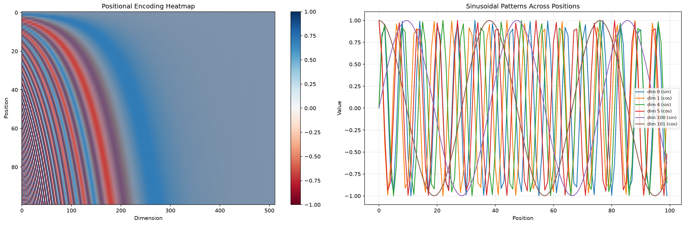
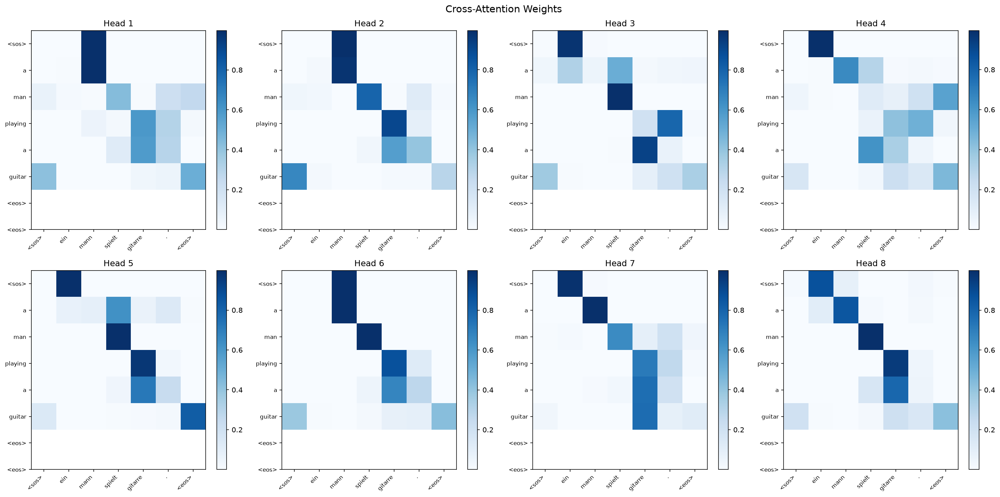
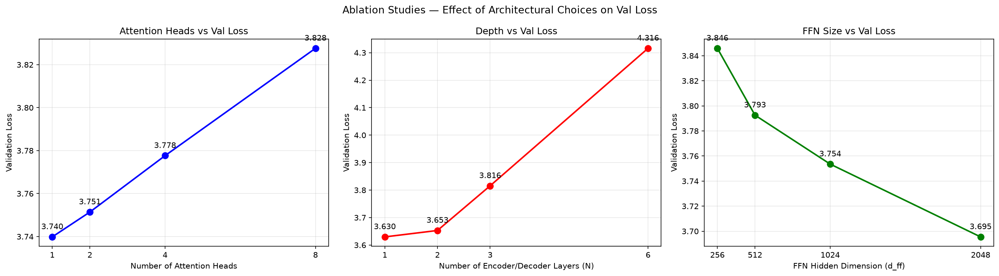

# Transformer from Scratch in Pytorch


A complete, paper-accurate implementation of the Transformer architecture
from ["Attention Is All You Need"](https://arxiv.org/abs/1706.03762) (Vaswani et al., 2017).

> Built from scratch in PyTorch. No HuggingFace. No `torch.nn.Transformer`. Every module implemented manually from the paper.

---
## Motivation

This project was built to understand the Transformer architecture from first principles by implementing every component described in the original paper without relying on high-level libraries such as HuggingFace or PyTorch's built-in Transformer modules.

Reading "Attention Is All You Need" raised more questions than it answered. Building it resolved them.

## What's implemented

| Component | Paper Section | File |
|---|---|---|
| Scaled Dot-Product Attention | 3.2.1 | `layers/attention.py` |
| Multi-Head Attention | 3.2.2 | `layers/multihead_attention.py` |
| Positional Encoding | 3.5 | `layers/positional_encoding.py` |
| Feed-Forward Network | 3.3 | `layers/feed_forward.py` |
| Residual + LayerNorm | 3.1 | `layers/sublayer.py` |
| Encoder | 3.1 | `encoder.py` |
| Decoder | 3.1 | `decoder.py` |
| Full Transformer | 3 | `transformer.py` |
| Warmup LR Schedule | 5.3 | `train.py` |
| Label Smoothing | 5.4 | `train.py` |

---

## Results

### Training (15 epochs, RTX 2050, d_model=256, N=3, batch=64)

| Epoch | Train Loss | Val Loss |
|---|---|---|
| 1 | 7.11 | 5.41 |
| 5 | 3.40 | 3.20 |
| 12 | 2.44 | **2.84** ← best |
| 15 | 2.19 | 2.89 |

**Sample translations after 15 epochs:**

| German (Input) | Model Output | Ground Truth |
|---|---|---|
| ein mann spielt gitarre . | a man playing a guitar | a man is playing a guitar |
| eine frau läuft durch den park . | a woman is walking through the park . | a woman is walking through the park |
| zwei kinder spielen im garten . | two children play in the garden . | two children are playing in the garden |
| ein hund rennt über das feld . | a dog runs through the field . | a dog is running across the field |

### Ablation Studies

Trained 12 configurations (3 epochs each) varying one parameter at a time:

| Variable | Finding |
|----------|---------|
| Attention heads | Fewer heads converge faster short-term; more heads need longer training |
| Depth (N layers) | Deeper = slower convergence; N=6 needs 5x+ more training than N=1 |
| FFN size | Larger d_ff consistently improves — d_ff=2048 best across all runs |

See `ablation_results/results.json` and `notebooks/ablation_studies.ipynb` for full data.

## BLEU METRICS

| Metric | Score |
|--------|-------|
| Val Loss (best) | 2.84 (epoch 12) |
| BLEU — Greedy | 34.08 |
| BLEU — Beam Search (k=4) | 35.25 |

## Visualizations

### Training Curves


### Positional Encoding


### Attention Maps (Cross-Attention, Last Decoder Layer)


### Ablation Studies



## Project Structure

```
transformer-from-scratch-pytorch/
├── layers/
│   ├── __init__.py
│   ├── attention.py           # Scaled Dot-Product Attention
│   ├── multihead_attention.py # Multi-Head Attention
│   ├── positional_encoding.py # Sinusoidal Positional Encoding
│   ├── feed_forward.py        # Position-wise FFN
│   └── sublayer.py            # Residual + LayerNorm wrapper
├── tests/
│   ├── test_attention.py      # 12 unit tests
│   └── test_model.py
├── notebooks/
│   ├── attention_visualization.ipynb
│   ├── positional_encoding.ipynb
│   ├── ablation_studies.ipynb
│   └── plot_curves.py
├── ablation_results/
│   └── results.json
├── encoder.py
├── decoder.py
├── transformer.py
├── train.py                   # Training loop, LR schedule, label smoothing
├── inference.py               # Greedy decoding
├── data.py                    # Custom vocab, dataset, dataloader
├── ablation.py                # Ablation experiment runner
├── requirements.txt
├── NOTES.md                   # Implementation decisions explained
└── README.md
```

---

## Setup

```bash
git clone https://github.com/arushiiii18/transformer-from-scratch-pytorch
cd transformer-from-scratch-pytorch
py -3.11 -m venv venv311
venv311\Scripts\activate        # Windows
pip install -r requirements.txt
```

**Download Multi30k dataset:**
```bash
python -c "
import urllib.request, gzip, shutil, os
os.makedirs('data_files', exist_ok=True)
files = {
    'train.de': 'https://raw.githubusercontent.com/multi30k/dataset/master/data/task1/raw/train.de.gz',
    'train.en': 'https://raw.githubusercontent.com/multi30k/dataset/master/data/task1/raw/train.en.gz',
    'val.de':   'https://raw.githubusercontent.com/multi30k/dataset/master/data/task1/raw/val.de.gz',
    'val.en':   'https://raw.githubusercontent.com/multi30k/dataset/master/data/task1/raw/val.en.gz',
}
for name, url in files.items():
    urllib.request.urlretrieve(url, f'data_files/{name}.gz')
    with gzip.open(f'data_files/{name}.gz', 'rb') as f_in:
        with open(f'data_files/{name}', 'wb') as f_out:
            shutil.copyfileobj(f_in, f_out)
    print(f'Downloaded {name}')
print('Done.')
"
```
---

## Run

**Train:**
```bash
python train.py
```

**Translate:**
```bash
python inference.py
```

**Tests:**
```bash
python -m pytest tests/ -v
```

**Pretrained checkpoint:**
Not included in the repo. Train from scratch — takes ~8 minutes on a modern GPU:
```bash
python train.py
```
Best checkpoint is saved automatically to `checkpoints/best_model.pt`.
---

## What I Learned

- Transformers didn't invent attention—they made attention the primary computational mechanism instead of a supporting component for recurrence.
- Multi-head attention isn't repetition, each head specializes in different linguistic relationships simultaneously.
- Feed-forward layers have a distinct job from attention: attention decides *what* to gather, FFN decides *what to do* with it.
- Positional encodings exist specifically because removing recurrence broke the model's only way of knowing word order — every design choice creates a new problem.
- Ablation studies showed why each component exists rather than assuming design choices were arbitrary.

## References

- Vaswani et al., [Attention Is All You Need](https://arxiv.org/abs/1706.03762), 2017

## Citation

If you found this implementation helpful, please consider starring the repository.

## License

This project is licensed under the MIT License. See the [LICENSE](LICENSE) file for details.
